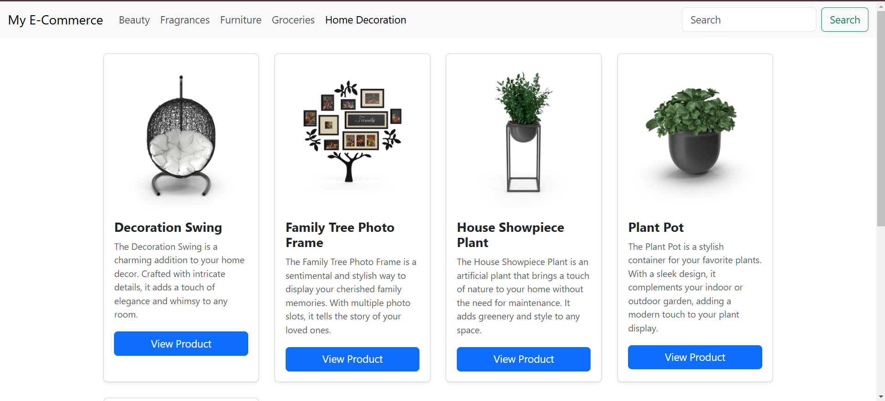
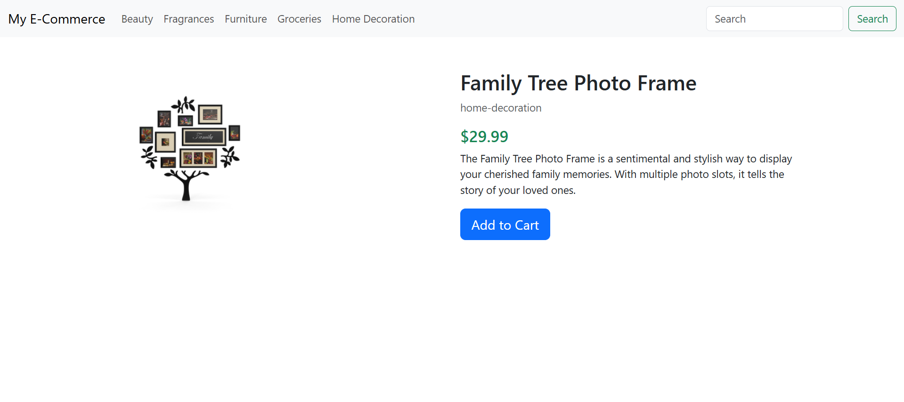
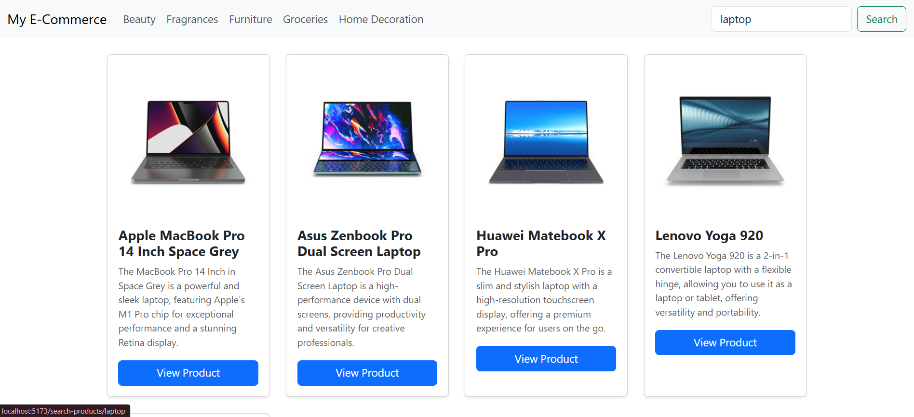
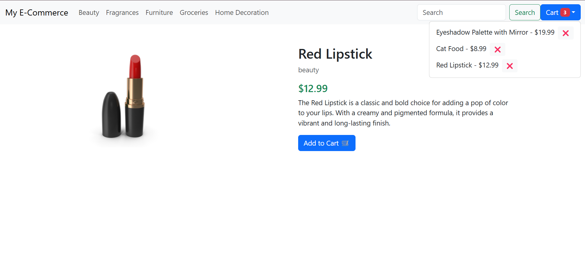

# E-Commerce Website  

## Project Overview  
This is a simple e-commerce web application built using React and Axios. The website dynamically fetches and displays product categories and product details from an API, allowing users to browse and filter products efficiently.  





## Project Structure  

```
src/  
│── assets/  
│── components/  
│   ├── UpperNavBar.jsx  # Navigation bar component  
│   ├── CartContext.jsx  # shared context to manage cart state
│── pages/  
│   ├── AllProducts.jsx  # Displays a list of products  
│   ├── ProductDetails.jsx  # Displays details of a single product  
│── App.jsx  # Main app component  
│── Layout.jsx  # Layout wrapper for the app  
│── main.jsx  # Entry point of the application  
```

## Features (Completed)  
✅ **Dynamic Navbar:** Fetches and displays categories from an API.  
✅ **Product Listing:** Retrieves a list of products from an API request.  
✅ **Filtering by Category:** Users can filter products by category ID using Axios.  
✅ **Add to Cart:** Implementing functionality to add products to the cart.  
✅ **Product Details Page:** Displays product details based on the selected product's ID using Axios.  
✅ **Search Functionality:** Enabling product search by name or category.


## Technologies Used  
- **React** (Frontend framework)  
- **Axios** (For API requests)  
- **React Router** (For navigation between pages)  

## How to Run the Project  
1. Clone the repository  
   ```bash
   git clone https://github.com/Ayat166/React-Day5.git
   ```  
2. Install dependencies  
   ```bash
   npm install
   ```  
3. Start the development server  
   ```bash
   npm start
   ```  

